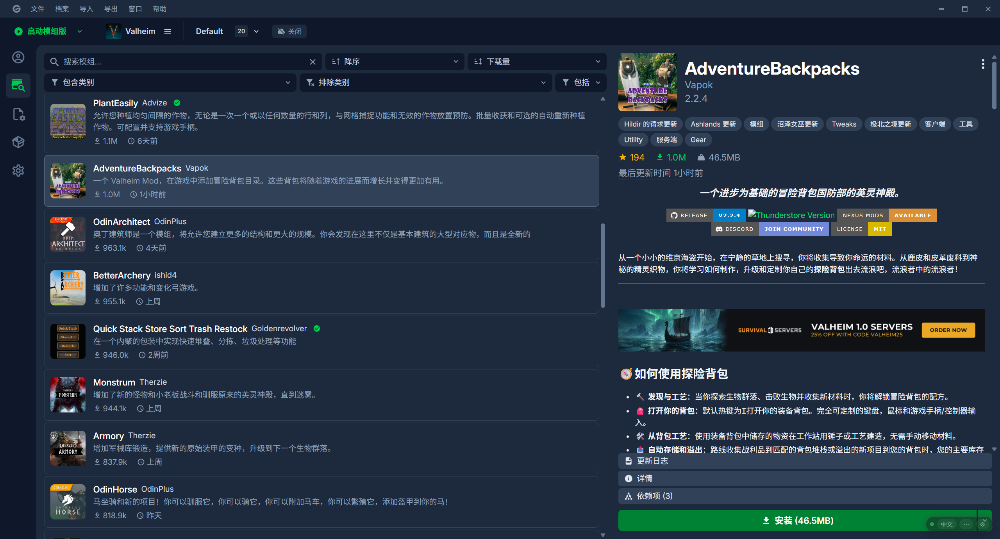
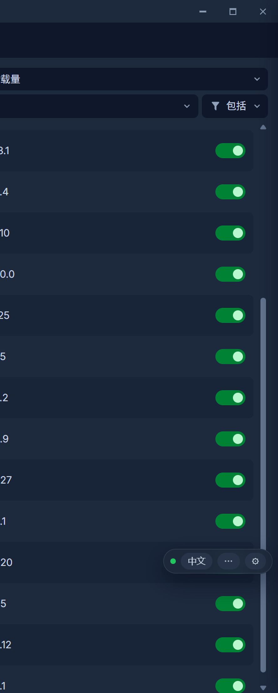

# Gale-Mod-Translator · Gale 汉化外挂

**给 [Gale](https://github.com/kesomannen/gale)（Thunderstore 的 mod 管理器）加一层外挂式实时汉化的 Windows 小工具。**
把搜索列表的简略介绍、右侧详情页 / README / 更新日志、模组配置页里的英文，实时翻译成你选的目标语言（默认简体中文，内置 **35 种**）。




## 它是什么（功能与原理）

**三个界面**：Gale 页面右下角的**悬浮控制条**（`中文 / 原文` 无损切换、`⋯` 展开节点下拉与已译计数、`⚙` 打开页内抽屉、可拖动并记住位置）；**页内设置抽屉**（Shadow DOM，不用切浏览器）；**独立设置页** <http://127.0.0.1:8799/>（固定暗色、宽屏居中，端口被占用会自动 +1）。

**原理**：`start.cmd` 用环境变量 `WEBVIEW2_ADDITIONAL_BROWSER_ARGUMENTS` 给 Gale 的 WebView2 开一个调试端口 —— 这只是启动参数，**不碰 Gale 的任何文件**。本地 Node 服务用 CDP 连上它，把 `core/inject.js` 注入页面（每次页面重载都自动重新注入）；注入脚本用「文本特征 + 结构启发式」挑出该翻译的英文，交给本地服务批量翻译（缓存 / 术语保护 / 固定词表 / 失败回退），再把译文写回页面 DOM；DOM 变化由 `MutationObserver` 实时跟进（虚拟列表滚动、切 mod、切详情/更新日志标签页）。

**为什么 Gale 更新也不怕**：定位规则不是写死的 CSS 类名，而是「排除界面框架 + 排除模组名/作者名/代码/配置文件名 + 其余英文内容区」，换版本、换皮肤、换卡片结构通常不用改代码。翻译只改文本节点的值，**原文全部留在内存**，`中文 / 原文` 随时无损切回；输入框、代码块、按钮、菜单一律不动。页面关掉就什么都不剩，`stop.cmd` 完全恢复原样；真失效时设置页的「查看页面识别情况」会给出识别到的模式、候选数与样本。



| 能力 | 说明 |
|---|---|
| 多节点择优 + 回译校验 | 同一段短文本让 2–4 个节点并发翻译、按质量评分挑最好的一条；「对比译法」可对一句英文并列所有节点的分数与扣分原因 |
| 术语表 / 保护规则 | 术语保护表（表里的词不翻）、`原文 = 译文` 强制指定译法、固定译法短语词典、译文后处理替换 |
| 模糊复用 | 只差版本号或标点的句子直接复用旧译文，并把新版本号按序回填，**零请求** |
| 限流冷却 | 节点被限流立刻冷却（1 → 2 → 4 → 8 分钟，上限 10 分钟）并切备用节点，不再反复硬打 |
| 公共译库 | `data/library.json`：导出 / 导入 / 订阅，浏览时自动收集；查表顺序 = 固定译法 → 节点缓存 → 译库 → 调节点 |
| 覆盖率体检 | 按「已翻译 / 未翻译 / 模组名保留 / 标识符保留 / 界面框架 / 术语表 / 机翻未改动 / 翻译失败」分类统计，每条样本可一键「翻译它 / 指定译法 / 保护它」 |
| mod 中文搜索 | 搜索框直接输中文，给出「固定词表命中 / 本地已见 mod / 建议英文关键词」三类建议 |
| 离线内置引擎 | 用 Edge 端侧翻译模型，跑在插件拉起的**无窗口 Edge** 里（独立 profile），装好语言包后完全离线 |
| 仅本地翻译 | 一键禁止一切非回环请求（网闸做在 `core/net.mjs` 的 `request()`），在线节点在界面里置灰 |
| 零第三方依赖 + 九套测试 | 只用 Node 内置模块，**不需要 `npm install`**；`npm test` 跑模糊复用 / 端口 / i18n / 限流 / 边界 / 内置引擎 / 快照回放 / 集成 / 滚动补翻 |

## 环境要求

| 项目 | 要求 | 说明 |
|---|---|---|
| **操作系统** | Windows 10 1809+ / Windows 11（x64） | 用到 `explorer.exe`、PowerShell、WebView2；macOS / Linux 未适配 |
| **Node.js** | **18 或更高**（开发机实测 `v24.21.0`） | 只用内置模块，**不需要 `npm install`**（项目零第三方依赖） |
| **Gale** | 一个能正常启动的桌面版 Gale（`gale.exe`） | 安装位置随意，设置页里可手动填或自动检测（本机实测 `D:\Gale\gale.exe`） |
| **WebView2 Runtime** | 随 Gale 装好即可（Windows 11 自带） | 外挂靠它的调试端口注入（本机实测 `154.0.4258.62`） |
| **Microsoft Edge（Chromium）** | 只有用「内置引擎」时需要 | 走 Edge 的端侧 Translator API（本机实测 `154.0.4258.62`） |
| **磁盘** | 约 **700 MB** 运行数据 | `data\edge-profile` 645 MB（其中内置引擎语言包 197 MB）+ 缓存；直接删目录即可回收 |
| **内存** | 无硬性要求 | 常驻服务很轻；用「内置引擎」时会多一个无窗口 Edge 进程 |
| **权限** | **普通用户即可** | 只有「接管原 Gale 快捷方式」这一个功能需要管理员 |
| **网络** | 在线节点、内置引擎首次下语言包时需要 | 支持「跟随系统代理 / 自动检测」；勾上「仅本地翻译」可完全断网 |
| **端口** | 服务 `8799`、调试端口 `9223` | 被占用会自动换端口，且都只绑定 `127.0.0.1` |

## 安装与使用

**方式一：用发布包（推荐）**

1. 从 [Releases](https://github.com/GreekSekiro/Gale-Mod-Translator/releases) 下载 `Gale-Mod-Translator-v0.1.0.zip`（`dist\` 是本地构建产物、不进仓库，想自己出一份就 `npm run package`）。
2. 解压到你自己喜欢的位置，例如 `D:\Gale-Mod-Translator`（**不要**放进 Gale 的安装目录）。
3. 装好 **Node.js 18+**（<https://nodejs.org>，一路默认即可）—— 已经装过就跳过。
4. 双击 **`start.cmd`**。

**方式二：从源码运行**

```bat
git clone https://github.com/GreekSekiro/Gale-Mod-Translator.git
cd Gale-Mod-Translator
node -v            :: 需要 v18 或更高
npm start          :: 等价于双击 start.cmd
npm test           :: 跑 9 套测试
npm run package    :: 生成 dist\Gale-Mod-Translator-v0.1.0.zip
```

**首次运行会发生什么**

1. 起一个本地服务（默认 `http://127.0.0.1:8799/`，被占用自动 +1），并把 `--remote-debugging-port` 交给 Gale —— Gale 已在运行（含托盘图标）时会问你是否关掉它，**必须重开**（正在跑的 Gale 没有调试端口，外挂挂不上）。
2. 在项目目录里生成 `config.json`（你的设置）、`logs\service.log`（日志）、`data\`（缓存 / 译库 / 内置引擎的独立 Edge profile）。
3. Gale 页面右下角出现悬浮控制条，点 `⚙` 就是页内抽屉。停止用 `stop.cmd`（会顺带问你要不要关掉 Gale）。

**日常用法**

| 想做什么 | 在哪做 |
|---|---|
| 切换译文 / 原文 | 悬浮条 `中文 / 原文`（无损，随时切回） |
| 换翻译节点 | 悬浮条 `⋯` 的节点下拉，或设置页 / 抽屉的「翻译节点」列表，点一下即切换 |
| 用内置引擎 | 节点选「内置引擎」→ 点「启用内置引擎」→ 等进度条走完保存。**首次需联网下约 200 MB 语言包**（实测 197.5 MB，十几秒到一分多钟，带速度与剩余时间估算），之后完全离线，每句约 10~20 毫秒 |
| 一个第三方请求都不发 | 勾「仅本地翻译（禁用联网）」：只允许回环地址节点，其余请求在 `core/net.mjs` 的 `request()` 层被硬拦；唯一例外是内置引擎首次下载语言包（只取模型，不含待翻译文本） |
| 改术语 / 固定译法 | 抽屉「术语与固定译法」三个文本框（术语保护表、固定译法、译文后处理替换），保存即生效 |
| 导出 / 导入 / 订阅译库 | 抽屉「缓存与译库」；导出为 `gale-lib-*.json`，导入支持本地文件与网址，订阅填一个或多个网址 |
| 只改某一项、不想刷页面 | 改动先记在抽屉里（按钮变「保存设置（N 项未保存）」），点一次统一**软应用**：重新拉配置 → 还原译文 → 重新扫描，不刷新页面、抽屉不关。只有「重新注入并刷新」才真的重载页面 |
| 更新 / 卸载 | 更新：用新包覆盖解压（保留 `config.json` 与 `data\` 就保住设置与缓存），或 `git pull` 后重新 `npm start`；卸载见常见问题 |

## 翻译节点一览

| 节点 | 用途 | 需要密钥吗 | 备注 |
|---|---|---|---|
| `builtin` 内置引擎（默认·置顶） | 零第三方、不占额度的本地翻译 | 不需要 | 跑在插件拉起的无窗口 Edge 里；首次需下约 200 MB 语言包，之后完全离线；质量略逊于大模型 |
| `tencent` 腾讯交互翻译 | 免密钥、国内直连，一次请求可翻多段 | 不需要 | 走**网页公开接口**，条款与限流不可控 |
| `youdao` 有道翻译 | 免密钥、国内可直连，长文本自动分段 | 不需要 | 同上；单段请求快但限流更严 |
| `google` Google 翻译 | 质量稳定的免费接口 | 不需要 | **国内直连不通，必须配代理**；按出口 IP 限流很严 |
| `deepl` DeepL | 质量最佳之一 | 要 API Key | 境外端点，需代理 |
| `openai` OpenAI 兼容大模型 | 推荐长期使用（DeepSeek / 硅基流动等） | 要 API Key | 术语最准、上下文理解最好，一个 Key 覆盖所有场景；境外端点需代理 |
| `local-llm` 本地大模型 | 用你自己电脑上跑的模型（Ollama / LM Studio） | 不需要 | 默认 `http://127.0.0.1:11434/v1`，填模型名即可；完全离线、不走代理 |
| `libretranslate` LibreTranslate | 自建实例 | 可选 | 只有填 `127.0.0.1` / `localhost` 才算本地节点，公共实例在「仅本地翻译」下会被停用 |
| `cache-only` 仅用缓存 | 只显示已翻译过的内容 | — | 完全不联网 |

- 默认节点是**内置引擎**；**备用链默认 `tencent, youdao`**（主节点失败时在这两个免密钥节点之间兜底），想彻底不让插件替你转发就清空它。
- 每个节点右侧可「停用」，「恢复所有被停用的内置节点」一键还原；需要密钥的节点选中后会自动展开密钥输入框，填完点「测试当前节点」验证。
- 还能**添加自定义节点**：请求地址 / 方法 / 请求头 / 请求体模板 / 响应取值路径（如 `translations[].text`）/ 是否批量发送；占位符 `{{text}}`、`{{texts_json}}`、`{{texts_joined}}`、`{{source}}`、`{{target}}`、`{{key}}`、`{{texts_count}}`。
- **代理**只给需要出境的节点用（Google / DeepL / OpenAI 兼容）：留空 = 直连，`system` = 跟随 Windows 系统代理，也可手填 `http://127.0.0.1:7892` 或 `socks5://127.0.0.1:10808`；旁边有「跟随系统代理」与「自动检测」。腾讯 / 有道是直连的，内置引擎、本地大模型、本机 LibreTranslate **不要填代理**。

## 常见问题

**Q：悬浮控制条没出现？**
必须由 `start.cmd` 启动 Gale，或者启动前 Gale 已**完全退出（含托盘图标）**——之前已在运行的 Gale 没有调试端口。设置页「运行状态」会写明原因，也可以点「以调试模式启动 Gale」；日志在 `logs\service.log`。

**Q：为什么第一次必须重开 Gale？**
调试端口是通过**启动参数**（环境变量）交给 WebView2 的，已经在跑的进程加不上；重开后外挂才挂得上去。

**Q：调试端口为什么不是我配置的那个？**
配置的端口被系统保留或被别的程序占用时，外挂会从它向上试绑、整段不行就让系统分配一个（实测过 `9223~9322` 整段被 Windows 保留、绑定直接 `EACCES`）。换到哪个会记在 `data\ports.json` 并在下次优先复用，实际端口写进 `data\runtime.json`，启动器和调试脚本都跟着走；只有你改 `config.json` 的 `cdpPort` 时才以配置为准。

**Q：语言包多大？下到一半失败了怎么办？**
约 200 MB（实测 197.5 MB），下载耗时十几秒到一分多钟，取决于网络到 CDN。失败时状态区会直接写出上次的错误原因；删了或没下完也不用怕——点一次「启用内置引擎」会先**清掉整个 `data\edge-profile`** 再重下（实测约 12~17 秒），"空壳目录"同样按不完整处理。

**Q：内置引擎会另外开一个浏览器？我怎么没看见？**
对，它用一个**无窗口（headless）的 `msedge.exe`** 跑端侧模型（Gale 的 WebView2 拿不到这层模型）。它不显示窗口、不占任务栏，用的是**独立 profile**（`data\edge-profile`），不影响你正在用的 Edge、读不到你的浏览记录或 Cookie，调试端口只监听 `127.0.0.1`；`stop.cmd` 会把它一起收掉，把节点换成别的下次就不会启动它。

**Q：翻译很慢 / 一直显示原文？**
点设置页或抽屉的「测试当前节点」。内置引擎首次要先下语言包；腾讯 / 有道免密钥可直连（仍可能被限流，界面有冷却倒计时）；DeepL / OpenAI 兼容要先填 API Key；Google / DeepL / OpenAI 这类境外端点还要在「网络代理」点「自动检测」或「跟随系统代理」。

**Q：报 `HTTP 429`（额度 / 频率受限）？**
被限流的节点会**立刻进入冷却**（1 → 2 → 4 → 8 分钟，上限 10 分钟）并自动切备用节点，不会反复硬打；多段短文本会合并成一次请求发给模型节点（合并结果行数对不上会自动退回逐段）。「运行状态」里有「节点被限流，正在冷却：deepl 还需 N 秒」和「解除冷却」按钮。

**Q：怎么只用本地模型？**
勾上「仅本地翻译（禁用联网）」，或直接把节点换成「本地大模型（Ollama / LM Studio）」/ 本机 LibreTranslate —— 这两条路径完全离线、无额度限制，也不需要下载语言包。

**Q：多个节点怎么选？**
想要零第三方、不占额度 → 默认的**内置引擎**；懒得下语言包、只想马上能翻 → **腾讯交互翻译**；要更高质量 → **DeepSeek（OpenAI 兼容节点）** 或 **DeepL**（都要自备 Key）；想要一次联网都没有 → 本地大模型 / 本机 LibreTranslate。

**Q：更新 Gale 后还能用吗？要不要重装外挂？**
不用重装。外挂不修改 Gale 文件，只依赖调试端口和页面文本特征。如果某块突然不翻了，看悬浮条有没有亮红点与「识别异常」角标，点 `⚙` 看自检原因，再用「覆盖率体检」看当前页面识别到了什么。

**Q：会不会把我正在编辑的内容改坏？**
不会。翻译只改文本节点的值，原文全部留在内存里，`中文 / 原文` 随时无损切回；输入框、代码块、按钮、菜单一律不动。

**Q：怎么彻底卸载？**
先 `stop.cmd`；如果开过「免启动器模式 / 开机自启」，在设置里点「还原」，再删掉整个项目目录（桌面上的「Gale 汉化」快捷方式若没被还原掉就手动删）；桌面残留的快捷方式与 `data\`、`config.json`、`logs\` 都随目录一起消失。

## 隐私与安全（风险说明）

- **只发要翻译的那段英文文本**给你选择的节点；不上传任何 Gale 数据、游戏文件或账号信息。配置与缓存在本机 `config.json` / `data\cache.json`，API Key 也只存在本机 `config.json`。选「仅用缓存」时完全不联网。
- **本地服务只放行本机来源**：监听 `127.0.0.1:8799` 并校验请求的 `Origin` —— 只允许本机设置页、注入到 Gale 的页面（`tauri.localhost`）以及没有 `Origin` 的命令行工具，其它来源一律 403。
- **内置引擎 / 本地大模型完全离线**：模型跑在本机（无窗口 Edge 用独立 profile `data\edge-profile`，调试端口只绑 `127.0.0.1`，只加载本机页面 `http://127.0.0.1:<服务端口>/edge-worker`，不接受外部导航），不涉及任何第三方接口条款。
- **免费网页接口的风险自负**：内置的腾讯 / 有道 / Google 三个节点**免密钥、开箱即用**，但它们走的是**网页公开接口**，不是官方开放 API —— 条款、限流与稳定性都不由本项目控制，待翻译的文本也会被送到对应厂商的服务器上。要长期、大量、可预期地使用，请换成**自备密钥的官方 API**（DeepL、OpenAI 兼容大模型）或**自建 / 本机服务**（内置引擎、本地大模型、LibreTranslate）。**Google 国内直连不通，必须配代理**。本项目不内置任何密钥，也不会帮你绕过服务方的限流。
- **不会悄悄转发**：`autoSwitchFromBuiltin` 默认为关 —— 内置引擎不可用时，插件不会把你的文本改发给腾讯 / 有道 / DeepL / OpenAI，界面只写明原因，换哪个节点由你决定。
- **调试端口的固有代价**：CDP 端点本身没有认证，同一台机器上的任意进程只要连上端口，就能完全控制 Gale 页面（执行任意 JS、读 localStorage、调用宿主命令）。端口只绑定 `127.0.0.1`，外网 / 局域网碰不到；介意的话不用时运行 `stop.cmd`。
- **删除 `data\` 就等于清空**：缓存、译库、内置引擎的独立 Edge profile（含语言包）都在里面，删掉即归还磁盘。
- **注册表策略残留排查**（更早的版本试过「组策略注册表」方案，现已废弃）：若曾用过，`HKCU` / `HKLM\Software\Policies\Microsoft\Edge\WebView2\AdditionalBrowserArguments` 可能留下策略项；值名被写成 `*` 会让这台机器上**所有** WebView2 应用都变成可调试状态，关掉 Gale 也不会解除。开一个 PowerShell 查、清：

```bat
reg query "HKCU\Software\Policies\Microsoft\Edge\WebView2\AdditionalBrowserArguments"
reg query "HKLM\Software\Policies\Microsoft\Edge\WebView2\AdditionalBrowserArguments"
:: 有的话清掉（HKLM 那条要以管理员身份运行）
reg delete "HKCU\Software\Policies\Microsoft\Edge\WebView2\AdditionalBrowserArguments" /f
reg delete "HKLM\Software\Policies\Microsoft\Edge\WebView2\AdditionalBrowserArguments" /f
```

## 许可与致谢

**许可**：本仓库目前是**私人仓库**，作者保留所有权利（All rights reserved）—— 在明确选定开源许可证之前，请不要转载、分发或用于商业用途。

**免责声明**：本项目是**非官方**的第三方工具，与 Gale（[kesomannen/gale](https://github.com/kesomannen/gale)）、Thunderstore 及其运营方均无隶属关系，也未获得其背书；使用免费网页接口的后果请自行评估。

**致谢**：[Gale](https://github.com/kesomannen/gale)（被汉化的对象，外挂只借用它的 WebView2 调试端口）、[Thunderstore](https://thunderstore.io/)（mod 数据来源），以及所有被翻译过的 mod 作者（译文内容的版权归原作者）。

版本历史见 [CHANGELOG.md](CHANGELOG.md)，规划见 [ROADMAP.md](ROADMAP.md)，截图见 [`docs/`](docs)。
