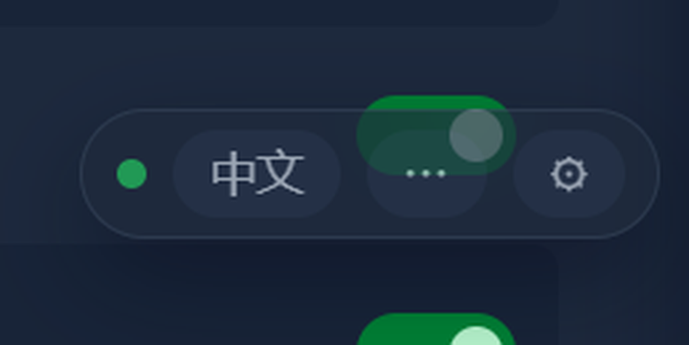
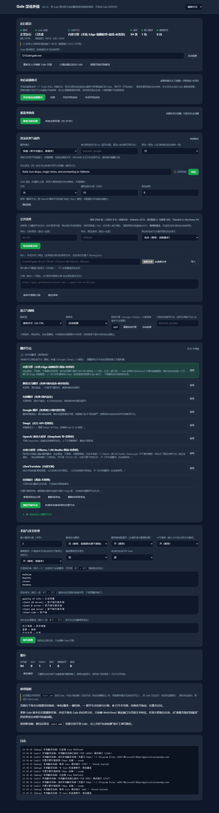
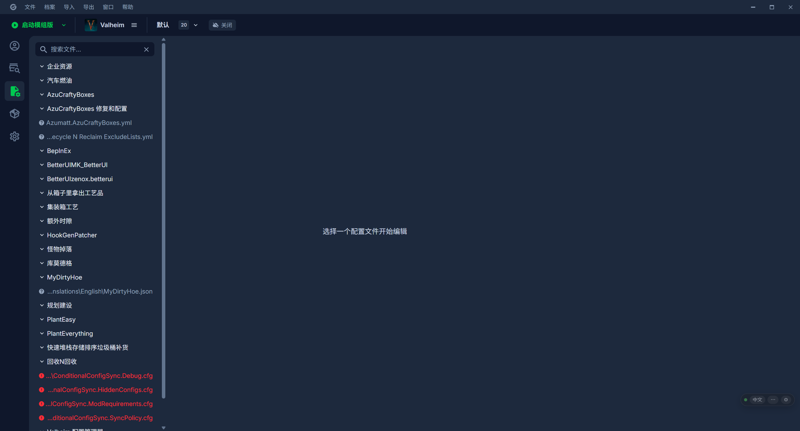

# Gale-Mod-Translator · Gale 汉化外挂

**给 [Gale](https://github.com/kesomannen/gale)（Thunderstore 的 mod 管理器）加一层外挂式实时汉化的 Windows 小工具。**
把搜索列表的**简略介绍**、右侧**详情页 / README / 更新日志**、**模组配置页**里的英文，实时翻译成你选的目标语言
（默认简体中文，内置 **35 种**语言），翻译节点可以随意**切换、添加、删除**。

> **不改动 Gale 的任何文件、不写入它的安装目录**——外挂只通过 WebView2 的调试端口往页面里注入脚本，
> 所以 Gale 更新版本后照常可用。
> 设置直接在 Gale 页内展开（右下角悬浮条 `⚙` → 侧边抽屉），改完当场生效。


---

## 特性一览

| | 特性 | 说明 |
|---|---|---|
| 🧩 | **零侵入外挂** | 不碰 Gale 的安装目录、不替换任何文件；关掉 `stop.cmd` 即完全恢复原样 |
| 🎯 | **页内设置抽屉** | 悬浮条 `⚙` 直接在 Gale 页面里滑出设置（Shadow DOM，支持中文/English 双语） |
| 🌐 | **9 个内置节点 + 自定义** | 内置引擎（端侧模型，免密钥）、腾讯、有道、Google、DeepL、OpenAI 兼容、本地大模型（Ollama…）、LibreTranslate、仅用缓存；另可添加任意自定义节点（请求地址/头/体模板/取值路径） |
| 🔌 | **内置引擎可离线** | 用无窗口 Edge 的端侧 Translator API，首次下载约 200 MB 语言包后**完全不需要联网** |
| ♻️ | **模糊复用** | 只差版本号/标点的句子直接复用旧译文，省下大量重复请求 |
| 🧪 | **覆盖率体检** | 体检当前页面，逐条列出未译文本，可一键「翻译它 / 指定译法 / 保护它」 |
| ⚖️ | **择优 + LLM 润色** | 同一段文本让多个节点各翻一遍打分；再用大模型统一润色 |
| 🔍 | **中文搜索** | 用中文关键词搜 mod（把关键词翻成英文再查） |
| 📚 | **公共译库** | 把翻过的 mod 描述攒成译库，支持导出 / 导入 / 订阅（含 GitHub 订阅链接） |
| 🚀 | **免启动器模式** | 生成桌面「Gale 汉化」快捷方式，双击即拉起服务 + 带调试端口的 Gale；可开机自启、可一键还原 |
| 🔒 | **隐私可控** | 只发要翻译的文本；服务只绑 `127.0.0.1` 并校验 `Origin`；「仅本地翻译」可彻底断网 |
| 🧰 | **零第三方依赖 + 9 套测试** | 只用 Node 内置模块，不需要 `npm install`；`npm test` 覆盖模糊匹配、端口、i18n、限流、内置引擎、节点、回放、集成流程 |

## 环境要求

| 项目 | 要求 | 说明 |
|---|---|---|
| **操作系统** | Windows 10 1809+ / Windows 11（x64） | 用到 `explorer.exe`、PowerShell、WebView2；macOS / Linux 未适配 |
| **Node.js** | **18 或更高**（开发机实测 `v24.21.0`） | 只用内置模块，**不需要 `npm install`**（项目零第三方依赖） |
| **Gale** | 一个能正常启动的桌面版 Gale（`gale.exe`） | 安装位置随意，设置页里可手动填或自动检测（本机实测 `D:\Gale\gale.exe`） |
| **WebView2 Runtime** | 随 Gale 装好即可（Windows 11 自带） | 外挂靠它的调试端口注入（本机实测 `154.0.4258.62`） |
| **Microsoft Edge（Chromium）** | 只有用「内置引擎」时需要 | 走 Edge 的端侧 Translator API（本机实测 `154.0.4258.62`） |
| **磁盘** | 约 **700 MB** 运行数据 | `data\edge-profile` 645 MB（其中内置引擎语言包 197 MB）+ 缓存；直接删目录即可回收 |
| **内存** | 无硬性要求 | 常驻服务很轻；用「内置引擎」时会多一个无窗口 Edge 进程 |
| **权限** | **普通用户即可** | 只有「接管原 Gale 快捷方式」这一个功能需要管理员 |
| **网络** | 在线节点、内置引擎首次下语言包时需要 | 支持「跟随系统代理 / 自动检测」；勾上「仅本地翻译」可完全断网 |
| **端口** | 服务 `8799`、调试端口 `9223` | 被占用会自动换端口，且都只绑定 `127.0.0.1` |

## 安装

### 方式一：用发布包（推荐）

1. 取 `Gale-Mod-Translator-v0.1.0.zip`（本仓库 `dist\` 下的构建产物，或 Releases 页面）。
2. 解压到你自己喜欢的位置，例如 `D:\Gale-Mod-Translator`（不要放在 Gale 的安装目录里）。
3. 装好 **Node.js 18+**（<https://nodejs.org>，一路默认即可）——已经装过就跳过。
4. 双击 **`start.cmd`**。

之后照 **[一、快速开始](#一快速开始)** 走即可（第一次启动会问你要不要重开 Gale，必须重开）。

### 方式二：从源码运行

```bat
git clone https://github.com/GreekSekiro/Gale-Mod-Translator.git
cd Gale-Mod-Translator
node -v            :: 需要 v18 或更高
npm start          :: 等价于双击 start.cmd
npm test           :: 跑 9 套测试
npm run package    :: 生成 dist\Gale-Mod-Translator-v0.1.0.zip
```

> 全程**不需要 `npm install`**：本项目只用 Node 内置模块，`package.json` 里没有任何依赖。

### 首次运行会发生什么

1. 起一个本地服务（默认 `http://127.0.0.1:8799/`），并把 `--remote-debugging-port` 交给 Gale；
   Gale 已在运行（含托盘图标）时会问你是否关掉它——必须重开，外挂需要一个调试端口。
2. 在项目目录里生成 `config.json`（你的设置）、`logs\service.log`（日志）、`data\`（缓存 / 译库 / 内置引擎的独立 Edge profile）。
3. Gale 页面右下角出现**悬浮控制条**；点 `⚙` 就是页内设置抽屉。

### 更新 / 卸载

- **更新**：用新包覆盖解压（保留 `config.json` 与 `data\` 就保住了设置与缓存），或者 `git pull` 后重新 `npm start`。
- **卸载**：先 `stop.cmd`；如果开过「免启动器模式 / 开机自启」，在设置里点**「还原」**再删目录；
  最后删掉桌面上的「Gale 汉化」快捷方式（还原失败时手动删）。删掉整个项目目录即可清理干净。

## 文档导航

| 文档 | 内容 |
|---|---|
| [一、快速开始](#一快速开始) | 3 步跑起来 + 悬浮条每个按钮干什么 |
| [二、原理](#二原理为什么版本更新也不怕) | 为什么不改 Gale 文件也能翻译、版本更新为什么不怕 |
| [三、目标语言](#三目标语言) | 35 种目标语言清单 |
| [四、翻译节点](#四翻译节点可增删) | 每个内置节点的特点、怎么加自定义节点、备用链 |
| [五、目录结构](#五目录结构) | 每个文件/目录是干什么的 |
| [六、测试](#六测试) | 9 套测试分别测什么、怎么跑 |
| [七、常见问题](#七常见问题) | 启动不了 / 不翻译 / 端口冲突 / 更新 Gale 后失效…… |
| [八、隐私与安全](#八隐私与安全) | 数据流向、调试端口的固有代价、安全建议 |
| [九、许可与致谢](#九许可与致谢) | 使用条款与参考项目 |
| [CHANGELOG.md](CHANGELOG.md) | 每个版本改了什么 |
| [ROADMAP.md](ROADMAP.md) | 已完成 / 计划中的事项 |
| [docs/](docs/) | 全部界面截图 |

> 当前版本 **0.1.0**（功能上是旧版 1.4 的超集：新增模糊复用、调试端口自动换端口、注入锚点自检、
> DOM 快照回放测试、页内设置抽屉；版本号重新起算，详见 [CHANGELOG.md](CHANGELOG.md)）。

---

## 一、快速开始

1. 安装 **Node.js 18 或更高版本**（<https://nodejs.org>，一路默认即可）。已装可跳过。
2. 双击 **`start.cmd`**。
3. 如果 Gale 已经在运行（含托盘图标），启动器会问你是否关掉它 —— 必须重开，外挂需要一个调试端口。
4. Gale 打开后，页面**右下角会出现一个悬浮控制条**：

   | 控件 | 作用 |
   |---|---|
   | `中文 / 原文` | 一键在译文和原文之间切换（无损，随时切回） |
   | `⋯` | 展开：翻译节点下拉框 + 已译计数（**向左侧展开**，悬浮条贴着屏幕左边缘时自动翻到右侧） |
   | `⚙` | 打开**页内设置抽屉**（不用切浏览器，见下） |
   | 拖动 | 直接拖动控制条换位置（自动记住） |

   若注入自检发现 Gale 前端结构可能已变化，悬浮条会亮红点并显示「识别异常」角标（悬停看原因）。

5. 设置面板：<http://127.0.0.1:8799/>（端口被占用时会自动 +1，以启动器打印的为准）。

**停止**：运行 `stop.cmd`（会顺带问你要不要关掉 Gale）。

> 翻译服务在后台运行，没有窗口。日志在 `logs\service.log`，缓存与运行状态在 `data\`。

### 页内设置抽屉（0.1.0 新增）

点悬浮条的 `⚙`，设置会**直接在 Gale 页面里**从右侧滑出（Shadow DOM，不影响页面本身）：

- **运行状态**：是否挂载、服务端口 / 调试端口（含端口记忆）、当前节点、本页已译段数、缓存与译库条数、模糊复用省下的请求数
- **注入自检**：结构变化时在这里给出原因与建议
- **翻译节点**：直接切换（改完点「保存设置」即软应用，不用刷新页面）、**按节点自动展开参数输入框**（DeepL / OpenAI 兼容 / LibreTranslate 的接口地址、API Key、模型）、测试当前节点、失败时的备用节点
- **自定义翻译节点**（折叠）：请求地址 / 方法 / 请求头 / 请求体模板 / 响应取值路径 / 批量发送，可增删改
- **语言与质量**：目标语言、快速 / 择优模式、择优参与节点、译法一致性
- **LLM 润色**（折叠）：开关、最短润色长度、每批段数、测试
- **对比译法**（折叠）：同一段文本让所有可用节点各翻一遍并打分
- **翻译行为**：翻译模组名、翻译配置页、悬停显示原文、中文搜索、模糊复用、最小翻译长度
- **网络代理**：跟随系统代理 / 自动检测
- **术语与固定译法**：术语保护表、固定译法、译文后处理替换，三个文本框直接改，保存即生效
- **覆盖率体检**：体检当前页面，每条未译文本可一键「翻译它 / 指定译法 / 保护它」——改完当场生效
- **缓存与译库**：条数概览、清空缓存；**译库导出 / 导入 / 订阅**（折叠）——
  译库用于**自用备份或小范围分享**（内容是你自己翻过的 mod 描述，版权归原 mod 作者）
- **系统集成**（折叠）：开启免启动器模式、开机自启、一键还原
- **最近日志**（折叠）：直接看服务最近的运行日志，不用去翻文件

抽屉底部有「打开完整设置页」，需要更细的配置时用。


右下角悬浮条（`中文` / `⋯` / `⚙`，可拖动、自动记住位置）：



完整设置页 <http://127.0.0.1:8799/>，固定用**暗色**（和 Gale 的默认皮肤同一套 slate + green），
内容居中：顶栏与内容区共用同一个 `max-width:1120px`，窗口再宽也是左右留白对称、不会出现横向滚动条：



**改选项不会立刻刷新页面。** 所有改动先记在抽屉里（左下角按钮会变成「保存设置（N 项未保存）」），
你可以连着改好几项，最后点一次「**保存设置**」统一提交——提交后做的是"软应用"
（重新拉配置 → 还原译文 → 重新扫描），**不刷新页面、抽屉不关**。旁边的「还原」可以丢弃未保存的改动。
只有点「重新注入并刷新」才会真的重载页面。

### 界面语言：中文 / English

设置页右上角、抽屉右上角都有语言下拉，**插件自身的界面**可以切换成英文（翻译的目标语言是另一回事）。
选完立刻生效并记进 `config.json`，下次打开还是这个语言。翻译节点名与说明也会跟着换成英文。

### 内置引擎：本地模型翻译（首次需联网下约 200 MB 语言包）

如果不想联网翻译、不想配任何密钥、也不想碰免费接口的条款问题，可以用**内置引擎**：

> **结论（实测）**：Gale 自己用的 **WebView2 不提供浏览器那层端侧翻译模型**
> （证据与机制见下面「几点说明」里的 ⚠），所以内置引擎**不能靠 Gale 的页面跑**。
> 插件现在的做法是：**自己拉起一个无窗口的 Edge**（独立 profile `data/edge-profile`、不显示窗口、
> 不抢你的 Edge、不影响你正在用的浏览器）来跑模型 —— **不需要你额外装什么**，系统里有 Edge 就行。
> 这一段 WebView2 的排查结论仍然保留在下面，因为它是"为什么要这么设计"的依据。

它用的是 Edge / Chrome 自带的**本地翻译模型**（Translator API），语言包跑在你自己电脑上，
翻译过程**不出本机**。代价是首次要下载约 200 MB 语言包（一次性，之后一直可用）。

**怎么用**：把「翻译节点」选成 **内置引擎** → 点「**启用内置引擎**」→ 等进度条走完 → 保存。
之后就是即时的，每句约 10~20 毫秒。

下载过程中会显示**进度条 + 已下载量 + 下载速度 + 已用时间 + 预计剩余**，方便判断是不是在正常下载：

```
正在下载语言包… 34%
[███████░░░░░░░░░░░░░░] 
约 67.2 MB / 197.5 MB · 约 12.3 MB/s · 已用 5 秒 · 剩余约 11 秒
```

> 关于那几个数字的**准确性**：浏览器的 Translator API 只提供 0~1 的百分比进度（拿不到字节数），
> 所以「已下载量」和「速度」是按语言包体积（实测 197.5 MB）换算出来的**估算值**，界面上都标了「约」。
> 百分比和剩余时间是准的。下载耗时波动很大（快的时候十几秒，慢的时候一分多钟），取决于你的网络到 CDN 的情况。

几点说明：

- 需要系统里装了 **Edge**（Windows 上基本都有）。模型**不是**跑在 Gale 的 WebView2 里，而是跑在插件
  拉起的**无窗口 Edge**里（原因见下面的 ⚠）；两条路都试过，只有后者在 Gale 里能用
- 语言包存在插件的 `data/edge-profile` 目录里（**不在** Gale 的目录、也不在你的浏览器 profile 里），
  升级插件、关 Gale、重启电脑都不会丢；想释放空间用「删除语言包」——注意它清空的是**整个** `data/edge-profile`
  （语言包约 197 MB 在里面，其余是 Edge 自己的组件缓存，整体积会慢慢涨到几百 MB）；
  删完再点一次「启用内置引擎」就会自动重新下载（实测十几秒）
- **可以自带一份语言包**（发布用）：把导出好的语言包放到 `data/edge-pack`（或项目根目录 `edge-pack/`），
  之后不管谁点到「启用内置引擎」，插件都会**先把这份复制过去**，不用联网、不用等下载。
  它只在"本机还没有完整语言包"时启用，**绝不会覆盖**已经下好的那份；复制的而不是搬走的，
  所以你删掉 `data/edge-pack` 才会省下那 ~201 MB，留着的话删了语言包还能再吃一次。
  用 `node tools/export-edge-pack.mjs` 可以从一份已经下好语言包的机器上导出（详见「发布时怎么自带语言包」）。
  想省磁盘的话，自带的那份也能删：点「打开语言包位置」会在资源管理器里打开它所在的目录
  （优先打开 `data/edge-profile/EdgeTranslateKitLanguagePack`，没有就打开 `data/edge-profile`、`data/edge-pack`、
  最后是 `data`），看清楚了直接删目录就行；「删除语言包」会把能删的一起清掉（含自带的那份），
  删它**不影响已经装好的引擎**，只是以后语言包再被清掉时要联网下载
- **删了也不会坏**：语言包被删掉、或者上次下载只下到一半，插件能认出来并**自动清掉旧数据重新下载**
  （详见下面「语言包被我删了 / 没下完，还能救吗」）
- 支持 en→中文（简/繁），以及 Chrome 官方支持的那批语言；源语言选「自动检测」时按英文处理
- 质量比大模型差一点，但日常看 mod 说明完全够用
- 它和别的节点一样能参与**择优**、走**译库/缓存**、受**术语表**保护

> ### ⚠ 为什么非要自己拉一个 Edge：Gale 的 WebView2 拿不到端侧模型
>
> 内置引擎靠的是**浏览器自带的端侧翻译模型**（Chromium / Edge 的 Optimization Guide，
> 由浏览器作为独立组件下载、按语言对安装）。实测（WebView2 运行时 = Edge **154.0.4258.62**）：
> **WebView2 拿不到这层模型** —— `Translator.availability()` 对**所有**语言对都返回 `unavailable`，
> `Translator.create()` 在 **1 毫秒内**抛 `NotSupportedError: Unable to create translator for the given source and target language.`，
> **连下载都不会开始**（`downloadprogress` 一次都不触发）。
>
> 机制上：Edge 浏览器的 profile 里有 `EdgeOptimizationGuideModelsManifest` 这类模型清单目录，
> 而 Gale 的 WebView2 profile（`%LOCALAPPDATA%\com.kesomannen.gale\EBWebView`）里**从来没有过**；
> 试过用 `--enable-features=OptimizationGuideModelDownloading,OptimizationGuideOnDeviceModel,...` 强制开启，
> **完全无效**（已确认开关真的传给了浏览器进程，结果与基线一字不差）。
> 硬件也排除了：16 GB 内存 / 16 线程 / 磁盘余量充足，且同一个页面里 `LanguageDetector`、`Summarizer` 都可用。
> Chromium 源码里模型运行时是 `//chrome` 层的一个组件（组件名就叫 `Chrome TranslateKit`），
> WebView2 不带这层组件更新栈；Microsoft 也从没在文档里说过 WebView2 支持它（官方只把它算作 Edge 浏览器能力）。
> **这不是改几行 JS 能修的。**
>
> 反过来说，**同一个 API 在真正的 Edge 里完全正常**：实测用 Edge **154.0.4258.62** 打开一个本地页面，
> `availability()` 返回 `downloadable`，`create({ sourceLanguage: 'en', targetLanguage: 'zh' })` **15 秒**就把语言包
> 下完（收到 131 次 `downloadprogress`），`translate()` 直接给出正常中文。所以缺的只是
> **WebView2 这一层**，并不是浏览器没有端侧翻译这个能力。
>
> **所以插件干脆自己拉一个 Edge 来跑它**（`core/edge-worker.mjs` + `core/edge-worker-page.js`）：
>
> - 用 `--headless=new` 起一个**无窗口**的 `msedge.exe`，**独立 profile**（`data/edge-profile`）、
>   独立调试端口（写 `--remote-debugging-port=0` 让系统分配，避开 Windows 的保留端口段），
>   调试端口只监听本机 `127.0.0.1`
> - 把与 Gale 页面**同一套**的内置引擎脚本注入进去（接口、文案、进度采样逻辑完全一致），
>   所以进度条 / 速度 / 剩余时间 / 重置 / 语言包占用与删除**全部照旧可用**
> - 只在内置引擎真的要用时才启动（服务启动时若语言包已在磁盘上会**预热**一次，第一次翻译就不用等）
> - 关服务（`stop.cmd`）时会把这个 Edge 一起收掉；`taskkill` 掉服务也不会留下孤儿进程
> - 内置引擎**优先**让 Gale 页面自己跑（万一你以后换的运行时支持它），页面不行才切到 Edge 后端；
>   两条都不行时界面会**如实写出原因**（不会再假装"还没下载"）
>
> 想在 Gale 里用**零条款风险的本地翻译**，这条（内置引擎）和下面「用自己本地的模型翻译」
> （Ollama / LM Studio）以及 LibreTranslate 都可以 —— 它们全都不联网、不涉及第三方条款。

**引擎管理**（选中「内置引擎」后，设置页和页内抽屉里都有）：

| 按钮 | 作用 |
|---|---|
| `启用内置引擎` | 准备语言包（跑在插件拉起的无窗口 Edge 里）：`data/edge-pack` 有自带的那份就**直接铺开、不联网**，否则才开始下载。按钮**始终不会被藏起来**；只有在两条后端都不可用时（系统里没有 Edge，且 Gale 页面自己也不支持）才会**置灰**并写明原因 |
| `下载语言包` | 语言包没下好就**立刻去下**（有自带语言包时是本地铺开，否则约 200 MB、带进度和速度）；已经就绪或正在下载时只如实汇报，不重复发起 |
| `重置引擎` | 丢掉后端里的模型实例，下次翻译重新创建。**不删磁盘文件**。翻译开始报错时不用重启 Gale 就能恢复 |
| `查看语言包占用` | 扫描磁盘上的语言包目录并列出占用（Gale 自己那份、插件 `data/edge-profile` 里那份、以及 `data/edge-pack` 自带的那份都会列，并写明"其中语言包 X MB / 整个 Edge 数据目录 Y MB"）；本机没装 Edge 时也会直接说明。**入口常驻**，与当前选的是哪个节点、引擎能不能用都无关 |
| `打开语言包位置` | 在资源管理器里打开语言包所在目录（按 `data/edge-profile/EdgeTranslateKitLanguagePack` → `data/edge-profile` → `data/edge-pack` → `data` 的顺序挑第一个真实存在的），打开哪个目录会写在下方说明里。**不删任何东西**，想手动清理或备份就点它 |
| `删除语言包` | 释放空间。插件自己那份：清掉**整个** `data/edge-profile`（语言包 + Edge 自己的组件缓存，能长到几百 MB），下次点「启用内置引擎」会自动装回来（约 200 MB）；Gale 自己那份：删目录，Gale 在运行时会拒绝（文件被占用），请先 `stop.cmd`；发布包里**自带的那份**（`data/edge-pack`）也会一并清掉。**需要点两次确认** |

> 如果状态区显示「⚠ 还没连接到 Gale」，那是**连接问题不是下载问题**——把 Gale 启动起来就会自动恢复
> （界面每 2 秒自动重试）。真遇到下载失败，状态区下面会直接写出**上次的错误原因**，
> 不用猜。设置里还留了一行诊断信息，会显示当前语言对的原始可用性（如 `en>zh=available`）。
>
> 如果状态区显示「⛔ 当前运行环境不提供端侧翻译模型…」，那说明**两条后端都不行**
> （系统里没找到 Edge，Gale 页面自己也不支持）——不是网络问题，也**不用再等下载**：
> 装个 Edge，或换节点（本地模型 / LibreTranslate）。
>
> 「语言包占用 / 删除」这一行**常驻**在设置页和页内抽屉里（故意放在内置引擎区块**外面**）：
> 它是纯磁盘操作，跟当前选的是哪个节点无关，所以引擎用不了时你也照样能删掉占空间的旧语言包。


### 仅本地翻译（禁用联网）（0.1.0 新增）

想**彻底不给第三方发文本**（开源插件、公司内网、或者只想验证本地引擎的翻译质量），
在设置页 / 页内抽屉的「翻译节点」上方勾选「**仅本地翻译（禁用联网）**」：

- 只允许**请求不出本机**的节点：内置引擎、本地大模型（Ollama / LM Studio）、
  本机 LibreTranslate、`仅用缓存`；其余节点（腾讯、有道、Google、DeepL、OpenAI 兼容大模型）在列表里**置灰并标注**「仅本地模式下已停用」
- 拦截做在**唯一的对外 HTTP 出口**上（`core/net.mjs` 的 `request()`）：只要目标不是
  `127.x` / `localhost` / `::1`，请求会**直接被拦下**并写明拦了谁。
  所以不只是翻译节点 —— LLM 润色、代理检测、译库导入 URL 等等全都发不出去
- 判定"本地"只看**地址是不是回环**：`local-llm` 指向 `192.168.x.x` 这种局域网地址同样会被拦（它不是本机）
- 即使你手工把节点改成 DeepL（或腾讯 / 有道 / Google），`/api/translate` 也会明确报错「仅本地模式已开启，当前翻译节点不是本地节点」，
  而**不是**悄悄发出去
- **唯一的例外**：内置引擎第一次要下载约 200 MB 语言包，那次下载会联网 ——
  它只取模型本身，**不会发送任何要翻译的文本**；界面上的说明里也写了这一条。
  语言包已在磁盘上时，整个过程完全离线

> 想 100% 不产生任何对外流量，就用**本地大模型**或**本机 LibreTranslate** 节点（它们不需要下载任何东西）；
> 内置引擎需要那一次模型下载。

### 用自己本地的模型翻译

除了内置引擎（浏览器自带的模型），也可以让插件去调**你自己电脑上跑的模型**：
选「**本地大模型（Ollama / LM Studio）**」节点，默认地址 `http://127.0.0.1:11434/v1`，填上模型名即可
（例如 `qwen2.5:7b`）。先在本地把模型跑起来，再点「测试当前节点」验证连通性。

同样是**完全离线、不联网、无额度限制**，而且质量通常比内置引擎更好——代价是要占内存/显存，
以及本地推理比内置引擎慢一些。这个节点**不走代理**（本地地址走代理反而连不上）。

### 模糊复用：只差版本号 / 标点的句子不再重复请求（0.1.0 新增）

同一个 mod 的说明常常只改了个版本号（`Requires Jotunn v2.1.0` → `v2.14.3`）。
以前这算「新句子」，要重新翻一遍；现在会先做**骨架归一化**（版本号→占位符，标点、大小写、空白归一），
骨架相同就直接复用已有译文，并**把新版本号按序填回译文**——零请求。

- 版本号个数对不上（旧译文里没有版本号、或数量不一致）就放弃复用，宁可直接翻译，也不给错的版本号
- 索引来自「节点缓存 + 公共译库」，按目标语言隔离、与翻译节点无关；骨架短于 8 字符不参与，避免误命中
- 命中后立刻固化成精确缓存，下次直接精确命中
- 可在设置页或页内抽屉关掉；省下的请求数见运行状态里的「模糊复用 N 段」

### 换到新电脑

解压后双击 `start.cmd` 即可。程序会自动寻找 Gale 的安装位置（注册表、快捷方式、常见目录）；
若没找到，在设置面板点「**自动检测**」或手工填写 `gale.exe` 路径。

### 更省事的用法：免启动器模式（1.3 新增）

不想每次都开 `start.cmd`？在设置面板点一下「**开启免启动器模式**」：

- 桌面会多一个 **「Gale 汉化」** 快捷方式（Gale 图标），**双击它就行**——
  后台服务、调试端口、Gale 全部自动起来，没有黑框闪过；
- 再点「**开启开机自启**」，登录后服务就在后台待命，之后你**怎么启动 Gale 都能被接管**；
- 「还原」按钮可把创建的快捷方式删掉、把被接管的快捷方式写回 `gale.exe`。

> 原有快捷方式位于 `公共桌面` 与 `开始菜单(ProgramData)`，改它们需要管理员权限。
> 一键开启时会改用用户级快捷方式；若想连原图标一起接管，右键运行项目根目录下生成的
> `接管原Gale快捷方式-需管理员.cmd` 即可（可选）。

### 用中文搜索 mod（1.3 新增）

在 Gale 的搜索框里**直接输入中文**，搜索框下方会弹出建议面板：

| 区块 | 内容 |
|---|---|
| 固定词表命中 | 你写过的 `中文 = 英文` 直接反查，点一下就搜 |
| 本地已见 mod | 你浏览过的 mod（英文名 + 中文简介），点击用英文名搜索 |
| 建议英文关键词 | 从已翻译的语料反查，例如「种植」→ plant / crops / flora / farming |

浏览过的 mod 会自动进本地索引（`data/mod-index.json`），越用越准；可在设置面板关掉。

### 覆盖率体检（1.3 新增）

设置面板「覆盖率体检」→「体检当前页面」或「体检全部页面」：按
**已翻译 / 未翻译 / 模组名保留 / 标识符保留 / 界面框架 / 术语表 / 机翻未改动 / 翻译失败**
分类给出统计与样本；每条样本可一键「翻译它 / 指定译法 / 保护它」。
Gale 更新后如果哪块不翻了，点一下就能定位原因。

### 译文质量：择优 + LLM 润色（1.4 新增）

**择优模式**（设置 → 译文质量 → 翻译模式选「择优」）：同一段短文本让 2–4 个节点并发翻译，
再用质量评分挑最好的一条。评分看这些：中文是否成立、专名/代码有没有丢、有没有复读或残留英文、
长度是否合理、与已有相似译法是否一致；勾上「回译校验」还会把候选翻回英文核对信息是否丢失。
只想看效果不想改设置？用「**对比译法**」：输入一句英文，所有节点各翻一遍，直接列出分数与扣分原因。

**LLM 润色**：机翻结果先上屏（不阻塞），随后成批交给大模型润色，润色完通过 CDP **直接替换页面文字，不用刷新**。
用的是「OpenAI 兼容」节点的接口地址 / Key / 模型（DeepSeek、硅基流动、本地 Ollama 都行）。

> 择优只对**列表简介 / 详情摘要 / 标签**这类短文本生效；README 长正文仍走单节点，免得请求量翻几倍。

### 公共译库：把译文攒起来分享（1.4 新增）

译库是一层**与翻译节点无关**的共享译文（`data/library.json`）。你浏览过的内容会自动进库，并带上游戏标签。
查表顺序：固定译法 → 节点缓存 → **译库** → 调用节点。

| 操作 | 说明 |
|---|---|
| **导出** | 生成 `gale-lib-zh-CN-Valheim-….json`，发朋友 / 传网盘 / 传 Gist 都行；可选限定语言、游戏，以及是否带上节点缓存里的历史译文 |
| **导入** | 支持本地文件、网址，也能直接吃对方的整个 `library.json`；默认只补缺、不覆盖 |
| **订阅** | 填一个或多个网址，一键拉取合并，用于持续同步社区译库 |

实测：导出 707 条（120 KB）→ 清空 → 导入 707 条；**把节点缓存清空、只留译库后重载页面，
节点请求 0 次、译库命中 24 段，页面照样全中文**——这就是分享译库的意义：别人不用再翻一遍。

---

## 二、原理（为什么版本更新也不怕）

```
Gale(WebView2)  ←─CDP(端口自动挑选)─  本地服务(Node)  ──HTTP──▶  各翻译节点
      │                                   ▲   │
      │                                   │   └──▶ 内置引擎：插件拉起的无窗口 Edge（独立 profile，CDP 驱动）
      └── 注入的页面脚本 ──HTTP(8799)─────┘
```

1. `start.cmd` 通过环境变量 `WEBVIEW2_ADDITIONAL_BROWSER_ARGUMENTS` 给 Gale 的 WebView2 开一个调试端口
   ——**只是启动参数，不碰 Gale 文件**。
2. 本地 Node 服务用 CDP 连上 WebView2，把 `core/inject.js` 注入页面，并在每次页面重载时自动重新注入。
3. 注入脚本用**文本特征 + 结构启发式**挑出"该翻译的英文"，交给本地服务批量翻译
   （带缓存、术语保护、固定词表、失败回退），再把译文写回页面。
4. 页面里的 DOM 变化（虚拟列表滚动、切换 mod、切换详情/更新日志/依赖项标签页）由 MutationObserver 实时跟进。

定位规则不是写死的 CSS 类名，而是"排除界面框架 + 排除模组名/作者名/代码/配置文件名 + 其余英文内容区"，
所以 Gale 换版本、换皮肤、换卡片结构后通常不需要改代码。真要失效时，设置页里的
“**查看页面识别情况**”会给出当前页面识别到的模式、候选文本数量与样本，据此可快速适配。

配置页（`/config`）使用一套更宽松的规则：左侧模组名与配置分组标题**会**翻译，而配置文件名与插件标识符保持原样。



---

## 三、目标语言

设置面板「语言」里选择，内置 35 种：

> 简体中文 · 繁體中文 · English · 日本語 · 한국어 · Русский · Français · Deutsch · Español · Português · Italiano ·
> Polski · Türkçe · Українська · Čeština · Nederlands · Svenska · Dansk · Suomi · Norsk · Ελληνικά · Magyar · Română ·
> Tiếng Việt · ไทย · Bahasa Indonesia · Bahasa Melayu · हिन्दी · বাংলা · தமிழ் · العربية · فارسی · עברית · Kiswahili · Filipino

也可以选「其他（手动输入语言代码）」自行填写。源语言默认「自动检测」。
各翻译节点会按自己的规范自动映射语言码（例如 DeepL 用 `ZH`、腾讯 / 有道 / Google 用它们各自的短码、OpenAI 兼容节点用 `zh-CN`、本地大模型直接用语言名），大模型节点则把语言名写进提示词。

> 术语保护表、固定译法、后处理替换、中英混排加空格都是中文专用，目标语言不是中文时自动跳过。
> 缓存按「目标语言 + 节点」分开存放。

---

## 四、翻译节点（可增删）

**开箱即用（不需要任何密钥）**

| 节点 | 密钥 | 联网 | 说明 |
|---|---|---|---|
| **内置引擎**（默认·列表置顶） | 不需要 | 仅首次下语言包 | 用 Edge 自带的本地模型。**装好语言包之后不联网、不消耗额度、不涉及任何第三方接口条款**。首次启用要联网下载约 200 MB 语言包（一次性，带进度条/速度/剩余时间）；发布包若自带语言包（`data/edge-pack`，见 §七）连这次下载都省了。模型跑在插件**自己拉起的无窗口 Edge** 里（原因见上文 ⚠）。质量略逊于大模型，但足够看 mod 说明 |
| **腾讯交互翻译**（推荐备用） | 不需要 | ☑️ 联网 | 免密钥、**国内直连**、一次请求可翻多段，速度和稳定性最好。走的是网页公开接口（见下方 ⚠） |
| **有道翻译** | 不需要 | ☑️ 联网 | 免密钥、国内可直连；长文本自动分段，单段请求快但限流更严 |
| **Google 翻译**（免费接口） | 不需要 | ☑️ 需代理 | 质量稳定；**国内直连不通，要在设置里配代理**。「自动检测」/「跟随系统代理」都行。按出口 IP 限流很严，被限流会自动冷却并切备用节点 |
| **本地大模型（Ollama / LM Studio）** | 不需要 | ❌ 全程本地 | 跑在你自己机器上的模型：完全离线、不联网、无额度限制 |
| **LibreTranslate（自建实例）** | 可选 | 取决于实例 | 填的是 `127.0.0.1`/`localhost` 才算本地节点；公共实例是外网地址，勾了「仅本地翻译」就会被停用 |
| **仅用缓存** | — | ❌ 不联网 | 完全不联网，只显示已翻译过的内容 |

> ⚠ **关于上面三个免密钥节点（腾讯 / 有道 / Google）**：它们的"免费"来自**网页公开接口**，
> 不是官方开放 API —— 条款、限流、稳定性都不由我们控制，译文也会被送到对应厂商的服务器上。
> 它们**开箱即用**（不用申请 Key），适合临时/轻度使用；**要长期、大量、可预期的使用，请换成自备密钥的官方 API
> （DeepL、OpenAI 兼容大模型）或本机 / 自建服务（内置引擎、本地大模型、LibreTranslate）**。
> Google 节点**国内直连不通，必须配代理**（点「自动检测」或「跟随系统代理」）；它按出口 IP 限流很严，
> 被限流时该节点会自动冷却、并按备用链切换。
> 想**彻底禁用联网**：勾上「仅本地翻译（禁用联网）」（见 §一 同名小节）——上面这三个和需要密钥的在线节点
> 都会在列表里置灰并标注「仅本地模式下已停用」，所有对外请求（含润色、代理检测）都会被硬拦。
> **默认节点仍是「内置引擎」**（列表置顶）：新装第一次打开时语言包还没下载，界面会**写明原因并让你自己决定**
> （点「启用内置引擎」下语言包，或者直接切到腾讯 / 有道）。
> **备用链默认为 `tencent, youdao`**（只在这两个免密钥节点之间兜底）；不想让插件替你转发就清空它，
> 节点失败时界面只写明原因、由你自己决定换哪个。

**需要密钥或需要本机资源的节点（适合长期/大量使用）**

| 节点 | 需要什么 | 说明 |
|---|---|---|
| **OpenAI 兼容大模型**（推荐） | API Key | 可填 **DeepSeek** / 硅基流动等；术语最准、上下文理解最好，一个 Key 覆盖所有场景 |
| **本地大模型（Ollama / LM Studio）** | 不需要 | 用**你自己电脑上跑的模型**翻译：完全离线、不联网、无额度限制。默认指向 `http://127.0.0.1:11434/v1`，填好模型名即可 |
| **DeepL** | API Key | 质量最佳之一 |
| **LibreTranslate** | 可选 | 适合离线/自建 |

> **该选哪个？** 想要**零第三方、不占额度** → 用默认的「内置引擎」（本地模型，首次要下约 200 MB 语言包）；
> 懒得下语言包、只想马上能翻 → 切 **腾讯交互翻译**（免密钥、国内直连，默认备用链第一个）；
> 想要**更高质量** → 用 **DeepSeek**（OpenAI 兼容节点）或 **DeepL**，两者都要自备 API Key。
> 长期/大量使用 → 上 **DeepSeek**（OpenAI 兼容节点），一个 Key 就够，不需要再配别家官方 API。
> 需要密钥的节点，选中后设置面板和抽屉都会自动展开密钥输入框，填完点「测试当前节点」验证。
> 密钥只存在本机 `config.json`，不会外传。

- **停用/删除**：每个内置节点右侧有「停用」按钮；「恢复所有被停用的内置节点」可一键还原。
- **添加自定义节点**：设置面板「➕ 添加自定义翻译节点」，填写

  | 字段 | 说明 |
  |---|---|
  | 请求地址 | 如 `https://api.example.com/translate` |
  | 请求方法 | POST / GET |
  | 请求头 | JSON，可用占位符，如 `{"Authorization":"Bearer {{key}}"}` |
  | 请求体模板 | 例如 `{"text":{{texts_json}},"from":"{{source}}","to":"{{target}}"}` |
  | 响应取值路径 | 如 `translations[].text`、`data[0].dst`；留空则自动识别常见结构 |
  | API Key | 可选，通过 `{{key}}` 引用 |
  | 批量发送 | 是：一次请求多段（用 `{{texts_json}}` / `{{texts_joined}}`）；否：每段一次（用 `{{text}}`） |

  可用占位符：`{{text}}` 单段文本 · `{{texts_json}}` JSON 数组 · `{{texts_joined}}` 换行拼接 ·
  `{{source}}` · `{{target}}` · `{{key}}` · `{{texts_count}}`

  加好后点节点上的「编辑」可修改，点「删除」可移除；选中它再点「测试当前节点」能立刻验证连通性。

- **代理**（**Google** / DeepL / 大模型这些需要出境的节点才用得上）：「网络代理」一栏支持四种写法

  | 写法 | 含义 |
  |---|---|
  | 留空 | 直连，不经过任何代理 |
  | `system` | **跟随 Windows 系统代理**（推荐）——大多数梯子会自动设置系统代理，端口变了也不用改 |
  | `http://127.0.0.1:7892` | 手工指定 HTTP 代理（Clash / 山海 等的混合端口） |
  | `socks5://127.0.0.1:10808` | 手工指定 SOCKS5 代理（v2rayN 等） |

  不想手填就点旁边的两个按钮：**「跟随系统代理」** 一键设为 `system`；
  **「自动检测」** 会读取系统代理、扫描常见本地代理端口（7890/7891/7892/7897/10808/10809…），
  逐个实测能否连上 DeepL / OpenAI 端点，可用的一键填好。
  代理只作用于需要出境的节点（**Google**、DeepL、OpenAI 兼容大模型）；**腾讯 / 有道是直连的，内置引擎、本地大模型、自建在 `127.0.0.1` 的 LibreTranslate 都跑在本机，不要给它们填代理**（填了反而会把本机请求也绕出去）。

- **备用节点**：主节点失败时自动顺次尝试。**默认 `tencent, youdao`**（只在这两个免密钥节点之间兜底）；
  想换成自己配好密钥的节点就填 `deepl, openai` 之类（逗号分隔），**想彻底不替你把文本转发出去就清空它**。
- **术语保护表**：表里的词不会被翻译；也可写 `原文 = 译文` 强制指定译法（例如 `Valheim = 英灵神殿`）。
- **固定译法（短语词典）**：整段完全匹配时直接采用、不调用翻译接口，内置了 Thunderstore 分类标签与常见小标题
  （`Quality of Life → 生活质量`、`Server-side → 服务端`、`Deep North Update → 极北之境更新` …），可自行增删。
- **机翻译文的通病**：机器翻译偶有生硬甚至荒唐的译文（例如把 `Open Source` 译得离谱）；
  免密钥的腾讯 / 有道 / Google 尤其如此（它们本来就是网页接口，质量与限流都不受我们控制）。
  重要内容建议换 DeepL / DeepSeek 这类质量更好的节点 —— 缓存按「目标语言 + 节点」分开存放，切换后重新翻一遍即可。

---

## 五、目录结构

```
Gale-Mod-Translator/
├─ start.cmd            一键启动（推荐入口，双击即可）
├─ stop.cmd             停止外挂
├─ VERSION              版本号
├─ CHANGELOG.md         更新日志
├─ ROADMAP.md           改进路线图
├─ package.json         仅元数据与脚本（运行时依赖依然是零）
├─ config.json          配置（设置面板改的就是它；首次启动后生成）
├─ core/
│  ├─ launcher.mjs      启动器：检查 Gale、拉起服务、打印指引
│  ├─ stop.mjs          停止脚本
│  ├─ server.mjs        本地服务：HTTP API + CDP 挂载 + 端口/路径探测 + 页面健康自检 + 配置迁移
│  ├─ defaults.mjs      默认配置（单独成模块，便于测试直接断言默认值）
│  ├─ cdp.mjs           CDP 客户端（自动重连 / 页面重载后重新注入 / 注入脚本不重复累积）
│  ├─ ports.mjs         端口试绑与选择 + 端口记忆（data/ports.json）
│  ├─ build.mjs         代码指纹（启动器靠它发现"后台服务是旧代码"并重启）
│  ├─ inject.js         注入到 Gale 页面的翻译引擎 + 悬浮控制条 + 覆盖率体检 + 锚点自检
│  ├─ edge-worker.mjs   内置引擎的「无窗口 Edge」后端：拉起/复用浏览器、语言包探测、状态与翻译转发
│  ├─ edge-worker-page.js 注入到那个 Edge 里的页面脚本（与 inject.js 同一套内置引擎逻辑）
│  ├─ drawer.js         注入到 Gale 页面的设置抽屉（Shadow DOM）
│  ├─ i18n.js           插件自身界面的中/英词典（设置页与抽屉共用）
│  ├─ translate.mjs     翻译编排：去重 / 缓存 / 译库 / 模糊复用 / 术语占位 / 择优 / 润色
│  ├─ providers.mjs     翻译节点适配器 + 自定义节点 + 语言映射
│  ├─ quality.mjs       译文质量评分（择优用）
│  ├─ cache.mjs         翻译缓存（落盘 data/cache.json）
│  ├─ library.mjs       公共译库（落盘 data/library.json）
│  ├─ system.mjs        快捷方式接管 + 开机自启
│  └─ net.mjs           带 HTTP / SOCKS5 代理支持的请求库
├─ ui/index.html        完整设置面板
├─ data/                缓存与运行时信息（自动生成；内置引擎的 Edge profile 在 data/edge-profile，发布的「自带语言包」放 data/edge-pack）
├─ logs/service.log     服务日志
├─ docs/                效果截图
├─ test/
│  ├─ fixtures/*.html   DOM 快照夹具（合成 + 可用 tools/snapshot.mjs 从真实 Gale 抓）
│  └─ expect/*.json     回放测试的期望结果
└─ tools/               调试、测试与打包脚本
   ├─ snapshot.mjs        从运行中的 Gale 抓 DOM 快照，固化为夹具
   ├─ replay-test.mjs     无头浏览器离线回放夹具，比对筛选规则
   ├─ test-fuzzy.mjs      模糊复用自测
   ├─ test-ports.mjs      端口选择与端口记忆自测
   ├─ test-i18n.mjs       界面词典自测（覆盖率 100% 断言 + 抽查）
   ├─ test-edge.mjs       边界与对抗性自测
   ├─ test-edge-worker.mjs 内置引擎的 Edge 后端契约自测（离线：常量/语言码/状态形状/源码约束）
   ├─ test-integration.mjs 集成冒烟（隔离服务 + 无头浏览器，验证 API、抽屉、密钥输入、悬浮条展开）
   ├─ test-builtin.mjs    内置引擎端到端（真下载语言包，手动跑）
   ├─ export-edge-pack.mjs 导出一份「自带语言包」（语言包 + 模型运行时，约 201 MB，见 §七 FAQ）
   ├─ cdp-port.mjs        解析当前实际调试端口（读 data/runtime.json）
   ├─ cdp-eval.mjs / cdp-act.mjs / cdp-shot.mjs   连上 Gale 执行 JS / 操作 / 截图
   └─ package.mjs         打包发布
```

**零第三方依赖**：只用 Node 内置模块，不需要 `npm install`。要求 Node.js ≥ 18（开发机实测 v24）。
测试会用本机已安装的 Microsoft Edge 做无头浏览器，不需要额外下载。

---

## 六、测试

```bash
npm test                  # 九套一起跑
npm run test:fuzzy        # 模糊复用单测（离线，16 项）
npm run test:ports        # 端口选择与端口记忆单测（离线，24 项）
npm run test:i18n         # 界面词典单测（离线，83 项，含 100% 覆盖率、三处界面共用主题 token 与设置页布局的断言）
npm run test:ratelimit    # 限流冷却与批量合并单测（离线，36 项）
npm run test:edge         # 边界与对抗性测试（离线，29 项：译库完整性 / 来源校验 / 异常输入）
npm run test:edgeworker   # 内置引擎的 Edge 后端契约自测（离线，140 项）
npm run test:replay       # DOM 快照回放（无头浏览器，3 个夹具）
npm run test:integration  # 集成冒烟（隔离服务 + 无头浏览器，176 项）
npm run test:scroll       # 滚动补翻回归（mock 翻译 + 无头浏览器，9 项）
npm run test:builtin      # 内置引擎端到端（真下载语言包，首次约 20~75 秒，之后秒级）
```

> `test:builtin` 不在 `npm test` 里：它要真实下载约 200 MB 语言包（缓存在 `test/.tmp/`，
> 只有第一次慢）。改动了内置引擎相关代码时单独跑它。
> `test:edgeworker` 是**离线**的（不下载、不拉浏览器），只验证常量、语言码映射、状态形状、
> 「删了语言包能不能重新下回来」「仅本地模式禁网」这两块的契约、
> 自带语言包（`data/edge-pack`）的铺开规则（缺 `EdgeLLMRuntime` 时**不许**先毁掉现有 profile、
> 只在没下好时才用、复制不移动、失败一律退回下载）与「没装 Edge」的文案与替代方案，
> 以及几处踩过坑的源码约束（比如"别把精简缓存当 API 结果返回"、"语言包目录名不能加 `^` 锚定"），
> 所以它在 `npm test` 里每次都跑。

- **模糊复用单测**：纯离线，验证「骨架归一 + 版本号回填」的正确性，以及端到端「模糊命中且请求数为 0」。
- **端口单测**：纯离线，验证「实际试绑 / 跳过被占端口 / 多候选优先级 / 兜底到系统分配」，
  以及端口记忆的读写与「改过配置端口就以配置为准」。
- **词典单测**：纯离线。先扫描设置页 / 抽屉 / 悬浮条里的**全部**中文文案（含 `placeholder` / `title`），
  断言 **0 条遗漏**；再抽查关键串与动态串的翻译结果。新增界面文案忘了加词条时，这条会直接报出来。
- **限流单测**：纯离线。验证冷却登记的递增/上限/清除、限流错误识别、
  OpenAI 兼容节点「多段合并成一次请求」以及**合并失败时安全退回逐段**，
  还有端到端「主节点被限流 → 自动切备用节点 → 冷却期内不再碰它 → 解除后恢复」。
- **滚动补翻回归**：起一个 mock 翻译接口 + 隔离服务 + 无头浏览器，跑真实链路 ——
  首屏翻译 → **追加新节点模拟虚拟列表滚动渲染** → 断言新内容被补翻 → 抽屉开 / 关后再各断言一次。
  Gale 的模组列表是虚拟列表，滚动会新渲染一批卡片；这条链路一断就是「首屏翻了、往下滚不翻」。
- **边界与对抗性**：专门打"平时不出事、一出事很难查"的地方 ——
  译库长译文不得被静默截断、缓存/译库文件损坏要能自愈、术语占位符被机翻吃掉时不得残留 `[[0]]`、
  非法配置类型不能让服务崩、异常输入要有友好报错，
  以及**本地服务只放行本机来源**（否则任意网页都能改你的配置、读走你的译库）。
- **回放测试**：把 `test/fixtures/*.html` 丢进无头 Edge，注入页面引擎的 **dry 模式**（不联网、不建悬浮条），
  调 `dryRun()` 得到「哪些文本会被翻译 / 为什么没翻」，与 `test/expect/*.json` 比对。
  改动筛选规则后跑一遍，就能立刻看出有没有误伤。
  - 确认新行为是对的：`npm run replay:update` 刷新期望
  - 只看当前结果：`npm run replay:print`
  - **想用真实 Gale 页面当夹具**：先启动 Gale（带调试端口），再 `node tools/snapshot.mjs /browse /config`，
    然后 `npm run replay:update`。抓取时会先把译文还原成原文，所以夹具可复现。
- **集成冒烟**：临时复制一份服务、用隔离配置启动（**不会动你的 `config.json`、不会启动 Gale**），
  再用无头 Edge 加载夹具、注入 `i18n.js` + `inject.js` + `drawer.js`，验证：API 与配置迁移、跨域 CORS、
  抽屉开合与新增设置项、**需要密钥的节点会自动展开参数输入框**、悬浮条展开方向（向左 / 贴边翻转）、
  **改选项不刷新页面 + 保存/还原按钮**、**中英切换（抽屉与设置页）**、
  **仅本地模式（节点过滤 / 网闸真拦得住 / 本机地址照样放行 / 配置往返）**，
  并断言**全程没有未捕获的 JS 异常**。

---

## 七、常见问题

**Q：悬浮控制条没出现？**
按顺序排查：

1. **Gale 必须带调试端口启动**——也就是由 `start.cmd` 启动，或启动前 Gale 已完全退出（含托盘图标）。
   Gale 之前若已在运行，它没有调试端口，外挂挂不上。设置面板的「运行状态」会写明原因，
   也可以点「以调试模式启动 Gale」。
2. **看 `logs\service.log`**。如果出现「调试端口 … 没有打开」，多半是端口问题（见下一条）。
3. **端口被系统保留了**（本机实测过：`9223~9322` 整段被 Windows 保留，绑定直接 `EACCES`）。
   这种情况 Gale 的 `--remote-debugging-port=9223` 根本开不起来。现在会自动绕开：
   从配置端口向上试绑，整段都不行就让系统分配一个空闲端口，并把原因写进设置面板「运行状态」。
   - 想自己确认：`netsh int ipv4 show excludedportrange protocol=tcp`
   - 想让它重新分配：以管理员执行 `net stop winnat` 再 `net start winnat`（重启后可能又回来）
   - 或者干脆把 `config.json` 里的 `cdpPort` 改成一个确定不在保留段里的端口（例如 `9581`）

**Q：调试端口为什么不是我配置的那个？**
因为配置的端口不可用（被系统保留或被别的程序占用），外挂会自动换一个。
换到哪个端口会**记下来**（`data\ports.json`），下次启动**优先复用上次那个**，不会再乱跳；
只有你把 `config.json` 里的 `cdpPort` 改掉时，才以你的配置为准。
实际端口也会写进 `data\runtime.json`——启动器和所有调试脚本都从那里读，所以不用改任何配置。
设置面板「运行状态」与页内抽屉里都会显示「调试端口 / 记忆」以及换端口的原因。

**Q：内置引擎会另外开一个浏览器？我怎么没看见？**
对，插件会用一个**无窗口（headless）**的 `msedge.exe` 来跑端侧模型（因为 Gale 的 WebView2 不提供这层模型，
见上文 ⚠）。它：不显示任何窗口、不占任务栏、**用的是自己独立的 profile**（`data\edge-profile`），
**不影响你正在用的 Edge**、不会读到你的浏览记录/Cookie；调试端口只监听 `127.0.0.1`。
只有在内置引擎真的要用（或语言包已下好、服务启动时预热）时才存在，`stop.cmd` 会把它一起收掉。
不想让它跑：把翻译节点换成别的即可（下次启动就不会预热它）。

**Q：语言包被我删了 / 没下完，还能救吗？**
能，点一次「启用内置引擎」就会**自动救回来**。以前这里有个真 bug：只删掉语言包目录时，
Edge 的**组件登记**还认为语言包装着，于是页面照旧报「可用」，但创建翻译器会立刻失败、
而且**永远不再下载**——表现就是"删掉之后内置引擎彻底废了，怎么点都没反应"。
现在的处理：

- 状态检测会发现「磁盘上没有完整语言包，页面却说可用」这种对不上的情况，标成**语言包不完整**（⚠ 提示）
- 点「启用内置引擎」时先**清掉整个 `data/edge-profile`**（这是实测唯一能让 Edge 重新下载的办法），
  再重新下载；下到一半的**空壳目录**（目录在、里面 0 字节）同样按不完整处理
- 语言包改成**按名字模式识别**（`TranslateKit*LanguagePack`），Edge 换版本、改目录名也认得出

所以「删除语言包」现在是**可逆**的：删掉 → 再点启用 → 重新下载（实测约 12~17 秒，437 MB 的
Edge 数据目录整个重建）。如果带了**自带语言包**（`data/edge-pack`），这一步连下载都不用，秒级铺开。

**Q：发布时怎么让插件「自带语言包」？**
在一台已经下好语言包的机器上跑：

```
node tools/export-edge-pack.mjs            # 精简版（约 201 MB）：语言包 + 模型运行时
node tools/export-edge-pack.mjs --full     # 整份 Edge profile（几百 MB，不推荐对外发）
node tools/export-edge-pack.mjs --out D:\somewhere\edge-pack
```

产物默认落在 `data/edge-pack`，压成 zip 挂到 Release，用户解压到项目根目录或 `data/` 下即可。
> 注意：**0.1.0 的官方发布包（`dist/Gale-Mod-Translator-v0.1.0.zip`）是"主包"，不含这份语言包**
> （`data/` 一律不进包）。也就是说用户第一次点「启用内置引擎」时还是要联网下那约 200 MB；
> 想连这一步都省掉，就按上面的命令自己导一份、连同 zip 一起挂到 Release。
> 用户想省那 200 MB 时：点「打开语言包位置」会在资源管理器里打开它，直接删目录即可；
> 「删除语言包」也会把它一起清掉。**主包不带语言包，所以没有单独的"删除自带语言包"按钮** —— 用不上。
精简版只含两样东西，都是实测出来**必须有**的：

- `EdgeTranslateKitLanguagePack/`（约 197.5 MB）：翻译模型本体；
- `EdgeLLMRuntime/`（约 3.3 MB）：跑模型用的 ONNX Runtime GenAI（`onnxruntime-genai.dll`）。
  **少了它，Edge 会说"可用"但 `Translator.create()` 立刻失败、而且永远不会重新下载** ——
  这个坑是逐项排除出来的（二分法：别的目录全移走也能翻，唯独缺它不行）。

`component_crx_cache`（那个 178 MB 的 CRX）和 `Local State` 实测**都不需要**，所以精简版不带
——顺带也不会把导出者电脑上的 Edge 账号信息一起发出去。导出工具发现没有 `EdgeLLMRuntime` 时会告警，
提醒你改用 `--full`。

**Q：我这台机器没装 Edge，内置引擎怎么办？**
内置引擎用的是浏览器自带的端侧模型，必须有一个 **Edge 148+**（装在标准位置；绿色版/非标准安装位置
可以用环境变量 `GALE_TRANS_EDGE_PATH` 指定 `msedge.exe`）。没装 Edge 时：

- 界面会**如实说明**「这台机器上没有找到 Microsoft Edge」，不再是含糊的"环境不支持"
- 「启用内置引擎」会置灰，并且**不会**偷偷去下载 200 MB
- 可以改用「本地大模型（Ollama / LM Studio）」或「本机 LibreTranslate」节点（同样完全本地、不联网），
  或者到设置里换成**免密钥的腾讯 / 有道**（就是联网了，文本会发到厂商服务器），
  也可以配一个带密钥的在线节点（DeepL / OpenAI 兼容大模型）

> 顺带一句：`autoSwitchFromBuiltin` **默认是关的** —— 内置引擎不可用时，插件**不会**把你的文本
> 悄悄改发给腾讯 / 有道 / DeepL / OpenAI。要换节点得你自己点头。

**Q：开了「仅本地翻译（禁用联网）」，为什么还看到它在下载 200 MB？**
那是**唯一**被允许联网的动作：内置引擎第一次要把语言包下下来（约 200 MB）。
它只取**模型本身**，不会发送任何要翻译的文本，界面说明里也写了这一条。
语言包已在磁盘上时，整个过程完全离线。想做到**一次联网都没有**，请改用
「本地大模型（Ollama / LM Studio）」或「本机 LibreTranslate」节点——它们不需要下载任何东西。
服务日志里也会为这次下载记一条 warn，写明"仅本地模式已开启，但语言包还没下载"。
（如果带了**自带语言包**（`data/edge-pack`），这次连下载都不会发生，日志会说明"使用随包自带语言包"。）

**Q：翻译很慢 / 一直显示原文？**
点设置面板或页内抽屉的「测试当前节点」。**内置引擎**（默认节点）首次要先下语言包；腾讯 / 有道免密钥、可直连
（仍可能被限流，界面会显示冷却倒计时）；DeepL / OpenAI 兼容大模型要先在节点里填好 API Key。
若用的是 **Google** / DeepL / OpenAI 这类境外端点，还需要配代理——点「自动检测」或「跟随系统代理」即可（记得先确认梯子已开启）。
想要更高质量，可以在「翻译节点」里选 DeepL 或 OpenAI 兼容大模型（DeepSeek 等），
选中后会展开密钥输入框，填完再点「测试当前节点」验证。

**Q：翻译节点报 `HTTP 429`（额度/频率受限）？**
三个免密钥节点（尤其是 **Google**，按出口 IP 限流很严）以及自备密钥的在线接口（DeepL、OpenAI 兼容）
都有额度与频率限制，短时间请求太多会被拒。现在的处理方式：

- 一旦被限流，该节点**立刻进入冷却**（首次 1 分钟，之后 2 / 4 / 8 分钟翻倍，上限 10 分钟），
  冷却期间自动改用备用节点；**不会再反复硬打**（以前每个片段都要重试两次，反而让限流更严重）
- 多段短文本会**合并成一次请求**发给模型节点，请求量能降一个数量级
  （合并结果行数对不上时会自动退回逐段，宁可慢也不会把译文错位）
- 设置页 / 页内抽屉的「运行状态」会显示「节点被限流，正在冷却：deepl 还需 N 秒」，旁边有「**解除冷却**」按钮
- 想马上重试：点「解除冷却」，或者换一个节点

**Q：模组名也被翻译了？**
默认不翻译列表里的模组名与作者名，个别漏网的把它加进术语保护表即可。
配置页左侧的模组名是**故意翻译**的（不想翻可在设置里关掉「翻译模组配置页」）。

**Q：更新 Gale 后还能用吗？**
能。外挂不修改 Gale 文件，只依赖 WebView2 调试端口和页面文本特征。万一将来某个 Tauri/WebView2 版本不再接受环境变量，
页面侧的注入逻辑完全不受影响——但**不要**再去用「组策略注册表」那套老办法（见本节末尾：它会拖慢 Gale 启动，
而且可能把整台机器的 WebView2 都变成可调试状态，现已废弃），可以改用
`--remote-debugging-port=<端口> --remote-allow-origins=*` 换个入口传参（例如自己包一层启动脚本）。

**Q：会不会把我正在编辑的内容改坏？**
不会。翻译只改文本节点的值，原文全部留在内存里，`中文/原文` 可随时无损切回；输入框、代码块、按钮、菜单一律不动。

**Q：9223 端口被别的程序占用了怎么办？**
不用管。启动时会先看 Gale 是否已经带调试端口在跑（包括上次服务分配的临时端口）；不是的话就从配置的端口
（默认 9223）向上找一个空闲端口，把实际端口写进 `data\runtime.json`，启动器和调试脚本都跟着走。
设置面板「运行状态」里能看到实际用的端口和换端口的原因。

**Q：更新 Gale 后突然什么都不翻了？**
先看悬浮条：如果出现红点和「识别异常」角标，说明注入自检判定前端结构变了。
点 `⚙` 打开页内抽屉，里面有具体原因（哪个锚点没命中、候选数是多少）；再用「覆盖率体检」看当前页面识别到了什么。
把结果发出来即可快速适配——`tools/snapshot.mjs` 还能把当时的页面抓成夹具，配一条回放测试防止再次退化。

---

## 八、隐私与安全

**隐私**：翻译只把**要翻译的那段英文文本**发给你选择的翻译节点；不上传任何 Gale 数据、游戏文件或账号信息。
配置与缓存都在本机 `config.json` / `data/cache.json`。选择"仅用缓存"时完全不联网。API Key 也只存在本机 `config.json`。

**本地服务只放行本机来源**：服务监听 `127.0.0.1:8799`，并校验请求的 `Origin`——
只允许本机设置页、注入到 Gale 的页面（`tauri.localhost`），以及没有 `Origin` 的命令行工具；
其它来源一律 403。否则你随便打开的一个网页就能改你的配置、读走你的译库。

**关于在线节点**：内置的**腾讯 / 有道 / Google** 三个节点免密钥、开箱即用，但它们走的是**网页公开接口**，
不是官方开放 API —— 条款、限流与稳定性都不由我们控制，用来翻译的文本也会被送到对应厂商的服务器上。
要**长期、大量、可预期**地使用，请换成**你自己配置的官方 API**（DeepL、OpenAI 兼容大模型）或
**你自建的服务**（本地大模型、LibreTranslate）；想要一次第三方请求都不发，就用**内置引擎**、
本地大模型、本机 LibreTranslate 或「仅用缓存」（再打开「仅本地翻译（禁用联网）」把口子彻底焊死）。
本项目不内置任何密钥，也不会帮你绕过服务方的限流（被限流时会冷却并按你配置的备用链切换）。
默认**不会**把内置引擎的文本悄悄转给任何在线节点（`autoSwitchFromBuiltin: false`）——
节点不可用时界面会说明原因，由你自己决定换哪个。

**「仅本地翻译（禁用联网）」**：勾上它以后，所有**目标不是本机**的 HTTP 请求都会在
`core/net.mjs` 这一层被直接拦下（翻译节点、LLM 润色、代理检测、译库导入 URL 全在内），
在线节点在界面里被置灰，配置里也会如实记下来（`offlineOnly: true`）。
唯一的联网动作是内置引擎**第一次下载语言包**（约 200 MB，只取模型，不含任何待翻译文本）——
想连这一次都省掉，就用本地大模型 / 本机 LibreTranslate 节点。

**关于内置引擎拉起的那个无窗口 Edge**：它用**独立 profile**（`data\edge-profile`，与你的 Edge 完全隔离）、
调试端口只绑定 `127.0.0.1`（端口由系统分配，不是固定值），只加载一个本机页面（`http://127.0.0.1:<服务端口>/edge-worker`），
不接受任何外部导航；`stop.cmd` 会把它一起关掉。

**关于调试端口**：外挂通过 WebView2 的 `--remote-debugging-port` 注入页面，这个端口**只绑定 `127.0.0.1`**，
外网/局域网碰不到。但 CDP 端点本身没有认证——同一台机器上的任意进程只要连上端口，就能完全控制 Gale 的页面
（执行任意 JS、读 localStorage、调用宿主命令）。这是该方案固有的代价，介意的话用完可以运行 `stop.cmd`。

**如果你曾经试过「组策略注册表」方案**（更早的版本尝试过，现已废弃）：那种做法会在
`HKCU\Software\Policies\Microsoft\Edge\WebView2\AdditionalBrowserArguments` 留下策略项。
如果值名被写成 `*`，会让这台机器上**所有** WebView2 应用都变成可调试状态——这是个真实的安全隐患，
而且关掉 Gale 也不会解除。**现在的方案走「快捷方式接管 + 环境变量」，不再依赖注册表**；
只想体检一下有没有残留，开一个 PowerShell 跑：

```bat
:: 看有没有残留（两条都查）
reg query "HKCU\Software\Policies\Microsoft\Edge\WebView2\AdditionalBrowserArguments"
reg query "HKLM\Software\Policies\Microsoft\Edge\WebView2\AdditionalBrowserArguments"

:: 有的话清掉（HKLM 那条要以管理员身份运行）
reg delete "HKCU\Software\Policies\Microsoft\Edge\WebView2\AdditionalBrowserArguments" /f
reg delete "HKLM\Software\Policies\Microsoft\Edge\WebView2\AdditionalBrowserArguments" /f
```

---

## 九、许可与致谢

**许可**：本仓库目前是**私人仓库**，作者保留所有权利（All rights reserved）——
在作者明确选定开源许可证之前，请不要转载、分发或用于商业用途。许可条款确定后会在本节与
[GitHub 仓库设置](https://docs.github.com/repositories/managing-your-repositorys-settings-and-features/customizing-your-repository/licensing-a-repository)里同步。

**免责声明**：本项目是**非官方**的第三方工具，与 Gale（[kesomannen/gale](https://github.com/kesomannen/gale)）、
Thunderstore 及其运营方均无隶属关系，不代表其立场，也未获得其背书。
内置的腾讯 / 有道 / Google 节点走的是**网页公开接口**，不是官方开放 API——条款、限流与稳定性都不由本项目控制，
请自行评估并在生产/长期使用场景中改用你自己配置的官方 API。

**致谢**：

- [Gale](https://github.com/kesomannen/gale)——被汉化的对象，外挂只借用它的 WebView2 调试端口；
- [Thunderstore](https://thunderstore.io/)——mod 数据来源；
- 所有被翻译过的 mod 作者：译文内容的版权归原作者，本项目只是把界面文本换成中文。

